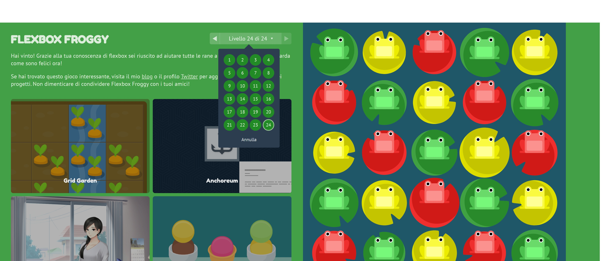
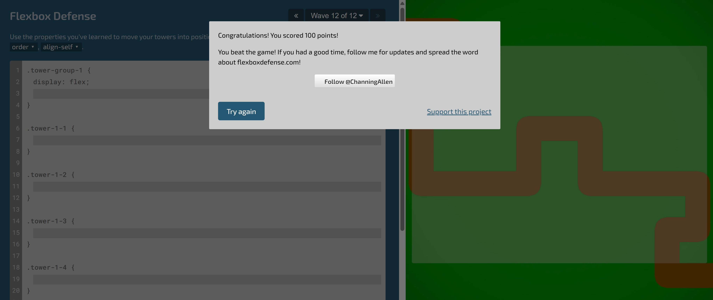

<h1 align="center">Flexbox Froggy & Flexbox Defense</h1>

###

  

###

###

Esercizio Completate tutti i livelli di questi due simpatici giochini: http://flexboxfroggy.com/ http://www.flexboxdefense.com/  Al termine di tutti i livelli caricate lo screenshot sulla repo in formato jpg.  Aiutatevi con le istruzioni che troverete nei giochi e con la guida di CSS tricks: https://css-tricks.com/snippets/css/a-guide-to-flexbox/

###

